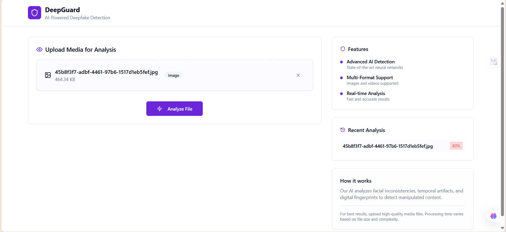
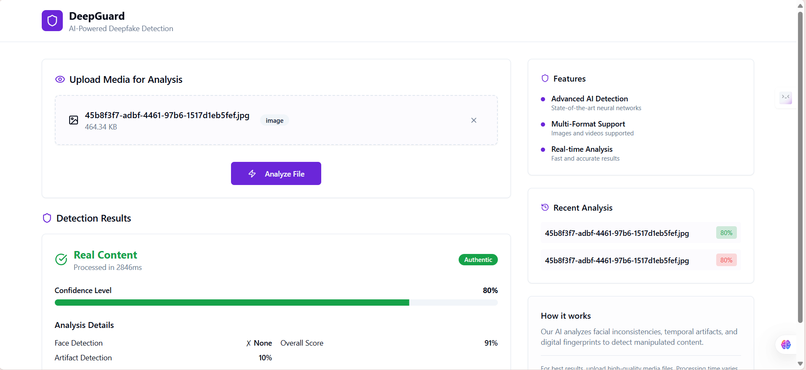
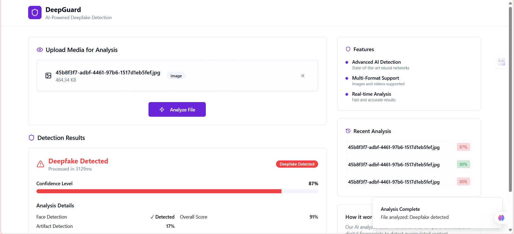

# DeepFake Detection Web App

A modern web application for detecting deepfakes using a CNN-based model and a beautiful Lovable UI frontend.

## Features
- Upload an image and detect if it's real or fake
- Displays confidence score
- Modern, responsive UI

## Workflow

1. **Clone the repository**
   ```bash
   git clone https://github.com/your-username/your-repo.git
   ```

2. **Backend Setup**
   ```bash
   cd backend
   python -m venv venv
   venv\Scripts\activate  # On Windows
   pip install -r requirements.txt
   uvicorn main:app --reload
   ```

3. **Frontend Setup**
   ```bash
   cd ../deepfake-detect-guardian-ui
   npm install
   npm run dev  # or npm start, depending on your setup
   ```

4. **Usage**
   - Open your browser at [http://localhost:3000](http://localhost:3000)
   - Upload an image and view the prediction

## Screenshots

### Home Page


### Prediction Result




---

## License
MIT 